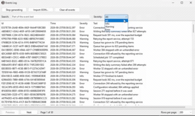
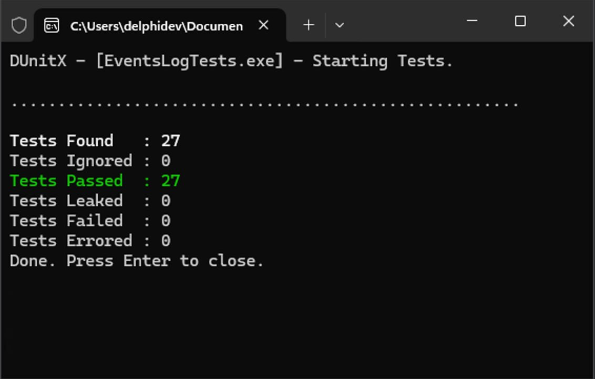

# Events Log

A VCL desktop application that keeps a log of events: a table of everything recorded, an import of
event history from JSON, search by message text, a filter by severity, and a background generator
that appends one random event a second.

Assignment statement: [docs/Test task Delphi Developer.md](docs/Test%20task%20Delphi%20Developer.md).



## Delphi version

Built with **Embarcadero RAD Studio 37.0, Personal edition** (`bds.exe` file version
37.0.60542.8024).

Only the standard RTL/VCL and FireDAC are used — no third-party components or packages.

## What it does

- **Events table.** Every event shows all four attributes in its own column: `Id`, `Time`,
  `Severity`, `Text`. Identifiers are UUIDs and are shown in full so they can be copied and compared
  ([ADR 0003](docs/adr/0003-uuid-event-identifiers.md),
  [ADR 0008](docs/adr/0008-listview-for-the-events-table.md)).
- **Import from JSON.** *Import JSON…* opens a file, validates it and shows a preview before
  anything is stored: one tab lists the events that will be imported, another lists every record
  that was rejected and why. A malformed file or a broken record never reaches the store and never
  crashes the application ([ADR 0014](docs/adr/0014-import-problems-window.md),
  [ADR 0015](docs/adr/0015-import-preview-and-confirmation.md)).
- **Search and filter.** The search box matches the event text, the combo box narrows the table to
  one severity. Both are evaluated as SQL, not as a scan in memory
  ([ADR 0010](docs/adr/0010-search-and-severity-filter.md)).
- **Background generation.** *Start generating* runs a generator thread that produces one random
  event every second and hands it to the UI thread; *Stop generating* ends it immediately. The
  window stays responsive throughout ([ADR 0011](docs/adr/0011-event-generator-thread.md)).
- **Paging.** The table shows one page at a time — 50, 100, 200 or 500 rows, newest first — with
  *Previous* / *Next* and a page indicator, so an unbounded log never has to be copied into the view
  ([ADR 0018](docs/adr/0018-paged-events-table.md)).

## Program structure

```
EventsLog.dpr            entry point and composition root
src/Model/               entities and filtering - knows about neither VCL nor JSON
  EventsLog.Event.pas      TLogEvent, TEventSeverity, and the text encodings of both
  EventsLog.Filter.pas     TEventFilter: search text plus a set of severities
src/Repository/          data access
  EventsLog.Database.pas       the FireDAC connection and where the database file lives
  EventsLog.Schema.pas         creates the table and its indexes on first run
  EventsLog.EventRepository.pas  IEventRepository: insert, count, read a page, delete all
  EventsLog.EventFile.pas      reads and validates a JSON file into events plus a report
src/Services/            background work
  EventsLog.Generator.pas        the TThread that produces one random event a second
  EventsLog.GeneratorSession.pas owns that thread and stores what it produces
src/UI/                  the form and its wiring
  Main.pas / .dfm            the window; wiring only, no business logic
  EventsLog.Table.pas        the virtual TListView, its paging and its refresh
  EventsLog.FilterBar.pas    the search box and severity combo, read as a TEventFilter
  EventsLog.Actions.pas      import, clear and the generator toggle behind one object
  EventsLog.ImportPreview.pas the modal that shows what an import would store
tests/                   DUnitX project and the sample JSON files
docs/adr/                architecture decision records
```

Dependencies point one way: `src/UI` → `src/Services` → `src/Repository` → `src/Model`. Nothing in
`src/Model` references another layer, and no unit outside `src/UI` uses `Vcl.*` or shows a dialog —
errors travel out as results or exceptions. No `TDataSet` leaves `src/Repository`: a query turns rows
into `TLogEvent` values before returning them.

Every decision worth questioning is written down as an ADR. [docs/adr/](docs/adr/) opens with a
one-line index of all eighteen, so you can pick the ones you want to argue with rather than read
them in order.

## Building and running

This edition of RAD Studio refuses command-line compiling — so building happens in the IDE:

1. Open `EventsLog.dproj`, pick a platform and press **Shift+F9** (Build).
2. The executable lands in `Win64\Debug\EventsLog.exe` (or the matching `Win32` / `Release` folder).

The tests are a separate DUnitX project, `tests/EventsLogTests.dproj`, covering the JSON validation
and the generator session against a fake repository. Build it in the IDE the same way; running it
needs no IDE:

```
make test      run the tests, exit code reports pass or fail
make status    say when the test binary was last built
make clean     delete the build output of both projects
```

`make` deliberately has no build target, for the reason above — and for the same reason there is no
CI pipeline.



## Data

### The JSON file

An array of objects with three string fields. `tests/sample-events.json` is the test data file:

```json
[
  { "time": "2026-08-19T08:14:02.000", "text": "Application started", "severity": "Info" },
  { "time": "2026-08-19T09:02:47.880", "text": "Disk space on volume C is below 15 per cent", "severity": "Warning" }
]
```

`time` is ISO 8601, and a trailing `Z` or an explicit offset is honoured and converted to local time;
`severity` is `Info`, `Warning` or `Error` compared without regard to case, and an unknown value makes
the record invalid — skipped and reported, never silently turned into `Info`. Identifiers are minted
on import, so an `id` key in the file is ignored and importing the same file twice stores its events
twice. An import **appends** rather than replaces, since the generator writes to the same log
([ADR 0009](docs/adr/0009-json-import-semantics.md)); *Clear all events* is what starts it empty.

Two more files sit beside it as fixtures for the tests and as something to try by hand:
`sample-events-invalid.json`, valid JSON whose records are broken one way each, and
`sample-events-malformed.json`, which is not JSON at all. Importing either shows what the application
does with bad input instead of describing it.

### Where the events are stored

`%LOCALAPPDATA%\EventsLog\events.db` — a SQLite database created on first run
([ADR 0005](docs/adr/0005-database-file-location.md)). **Deleting that folder resets the application
to empty.** The path is per user, so two accounts on one machine keep separate logs, and copying the
executable elsewhere does not bring the data along.

## What could be improved with more time

### Carrying millions of events

The application is sized for the load the statement describes, one event a second. The items below
are where it would stop being comfortable long before it stopped working. Everything that touches the
schema needs `PRAGMA user_version` and a migration step first, which the schema does not have yet.

1. **Keep `count(*)` off the hot path.** The table counts the whole filtered set on every refresh —
   on each keystroke in the search box, and four times a second while the generator runs. Together
   with a `LIKE` scan that is a full table scan several times a second, and it is the first thing
   that would freeze the window on a large log. Counting with a cap
   (`select count(*) from (select 1 … limit 10001)`, shown as "10,000+") is the cheap fix; paging by
   key removes the need for a total altogether.
2. **Index the text search with FTS5.** `text like '%…%'` can never use an index, so every search is
   a second full scan. An FTS5 shadow table with the trigram tokenizer turns "contains" into an
   indexed lookup and, as a side effect, removes the ASCII-only case folding recorded in
   [ADR 0010](docs/adr/0010-search-and-severity-filter.md) — `помилка` would finally match
   `Помилка`. The cost is a set of triggers and roughly half again the database size.
3. **Page by key instead of by offset.** `offset` makes SQLite walk past every row it skips, so page
   500 costs five hundred times page 1. A `where (time, id) < (:lastTime, :lastId)` predicate makes
   every page cost the same. The trade is real and revises
   [ADR 0018](docs/adr/0018-paged-events-table.md): no jumping to page 137, only newer/older plus a
   jump by time.
4. **Encode the columns for the index, and mint UUIDv7.** `time` is 23 bytes of ISO text, `severity`
   a whole word, `id` a 36-character UUID as the primary key. Size is the smaller problem; locality
   is the larger one, because a random v4 identifier lands on a random B-tree page at every insert.
   Integer time, integer severity and a 16-byte blob id would shrink the indexes, and UUIDv7 — being
   time-ordered — would let the index append again while keeping the "nobody coordinates" property
   that won [ADR 0003](docs/adr/0003-uuid-event-identifiers.md).
5. **One composite index in place of two thin ones.** An index over three distinct severities buys
   little, and every query has the same shape: filter, then `order by time desc`. A composite
   `(severity, time desc)` — or partial indexes on Warning and Error — serves that shape directly,
   with `ANALYZE` so the planner has statistics to choose it.

### Development and observability

1. **Give the application a log of its own.** An events log that records nothing about itself is a
   poor witness. A file under `%LOCALAPPDATA%\EventsLog\log\` holding the startup facts — database
   path, schema version, SQLite version — plus every query slower than a threshold and every
   exception, together with an `Application.OnException` handler, would mean a problem in the field
   leaves a trace instead of a dialog nobody wrote down.
2. **Settle the build question.** There is no CI because this edition refuses command-line
   compiling. Either a licence tier that unlocks `dcc32`/`dcc64`, or a self-hosted runner on a
   machine with the IDE, or a deliberate no — and in that last case, automating everything that does
   not need a compiler: broken Markdown links, duplicate ADR numbers, IDE noise in `.dproj`, and the
   check that every new unit under `src/` is registered in the `.dpr`.

### Usability

1. **Colour the row by severity.** Red for Error, amber for Warning. All three levels look alike
   today, so an error sinks into the Info around it. This is the cheapest change here and the one
   most felt: the log becomes something scanned rather than read.
2. **Debounce the search, and show when a query is slow.** Every keystroke queries the database
   immediately. Waiting 250–300 ms after the last one is a handful of lines and the largest single
   improvement in how quick the window feels, before any SQL is touched. A busy indicator past
   ~200 ms would stop a working query from looking like a frozen table.
3. **A filter on a time range** — the last hour, today, or a chosen span. For a log this is a more
   natural cut than text search, and unlike text search it rests on an index, so it stays fast at
   any size.
